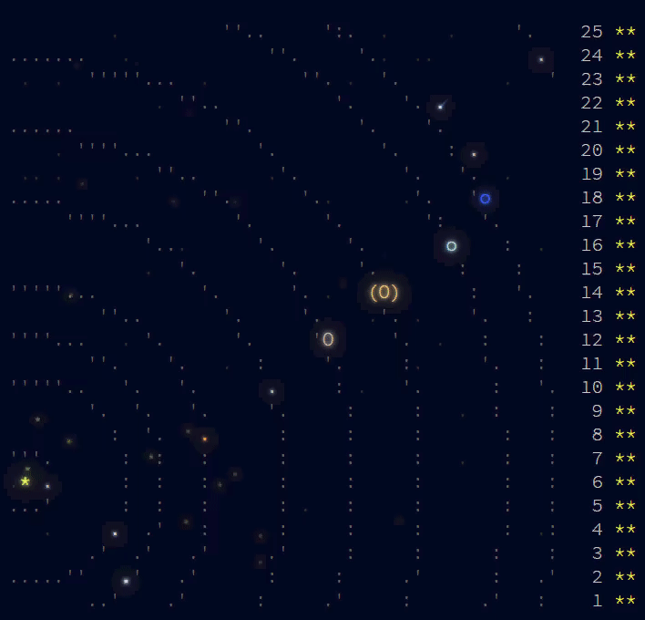

# aoc19
Advent of Code 2019 in C++
## Computation times (no optimizations, both parts run separately and parse the input file).
Processor: Intel Core i7-7700HQ, single thread unless indicated

Day | Part One [ms] | Part Two [ms]
--- | ---: | ---:
Day 01: The Tyranny of the Rocket Equation | 2.528 | 4.202
Day 02: 1202 Program Alarm | 4.062 | 8.543
Day 03: Crossed Wires | 4.512 | 2.604
Day 04: Secure Container | 8.008 | 11.601
Day 05: Sunny with a Chance of Asteroids | 1.406 | 1.752
Day 06: Universal Orbit Map | 11.809 | 10.258
Day 07: Amplification Circuit | 4.365 | 4.612
Day 08: Space Image Format | 1.304 | 18.233
Day 09: Sensor Boost | 8.634 | 7.069
Day 10: Monitoring Station | 36.054 | 147.214
Day 11: Space Police | 21.625 | 21.705
Day 12: The N-Body Problem | 1.402 | 9.598
Day 13: Care Package | 2.210 | 24.152
Day 14: Space Stoichiometry | 4.908 | 7.072
Day 15: Oxygen System | 12.578 | 16.133
Day 16: Flawed Frequency Transmission | 391.793 | 146.775
Day 17: Set and Forget | 2.401 | 49.614
Day 18: Many-Worlds Interpretation | 7037.083 | 20.417
Day 19: Tractor Beam | 17.554 | 101.978
Day 20: Donut Maze | 17.905 | 1142.790
Day 21: Springdroid Adventure | 5.895 | 13.119
Day 22: Slam Shuffle | 1.025 | 0.878
Day 23: Category Six | 2.646 | 6.187
Day 24: Planet of Discord | 1.067 | 8.467
Day 25: Cryostasis | 26.626 | - 

Total time: 9.414 seconds

## And so the warp drive has been aligned!
